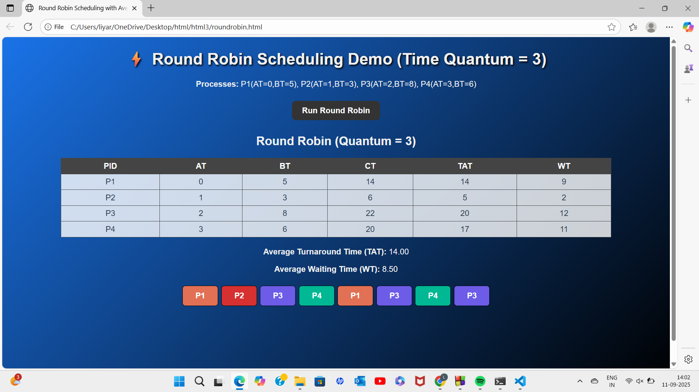

# CPU Scheduling Demo  

This repository demonstrates multiple **CPU Scheduling Algorithms** implemented using **C** and **HTML/JavaScript (Web)**. It includes both program logic and visual outputs for better understanding.  

---

## 📌 About Scheduling Algorithms  

- **FCFS (First Come First Serve):**  
  A non-preemptive algorithm that executes processes in the order they arrive.  

- **SJF (Shortest Job First):**  
  A non-preemptive algorithm that prioritizes the process with the smallest burst time.  

- **Round Robin:**  
  A preemptive algorithm that assigns a fixed time quantum to each process, allowing for fair CPU time distribution.  

**General formulas (for all):**  
- `Start Time = max(Current Time, Arrival Time)`  
- `Completion Time = Start Time + Burst Time`  
- `Waiting Time = Start Time – Arrival Time`  
- `Turnaround Time = Completion Time – Arrival Time`  

---

## 📂 Repository Structure  

- `fcfs.c` → **Liya Reji’s FCFS** implementation in C  
- `fcfs.html` → **Rose Brijit’s FCFS** web-based implementation (HTML + JS)  
- `sjf.html` → **Nowrin’s SJF** web-based implementation (HTML + JS)  
- `roundrobin.html` → **Liya Reji’s Round Robin** web-based implementation (HTML + JS)  
- `fcfs.png` → FCFS output screenshot  
- `roundrobinoutput.png` → Round Robin output screenshot  
- `fcfsop.pdf` → Documentation for FCFS  
- `README.md` → Project documentation  

---

## 👨‍💻 Contributors & Work  

### **Liya Reji – FCFS (C) & Round Robin (HTML/JS)**  
- **FCFS (C):**  
  - Reads process details (arrival, burst time).  
  - Calculates start, completion, waiting, turnaround times.  
  - Displays results in a clean tabular format.  

- **Round Robin (HTML/JS):**  
  - Web-based interactive simulation.  
  - Supports quantum-based preemptive scheduling.  
  - Displays dynamic table & Gantt chart in browser.  

---

### **Rose Brijit – FCFS (HTML/JS)**  
- Implemented in **HTML + JavaScript**.  
- Provides an interactive FCFS simulation in browser.  
- Displays process execution order and results visually.  

---

### **Nowrin – SJF (HTML/JS)**  
- Implemented in **HTML + JavaScript**.  
- Web-based SJF simulation.  
- Shows process scheduling dynamically with table & Gantt chart.  

---

## 🖼 Screenshots  

### FCFS Output  
  

### Round Robin Output  
  

---

## 🚀 Run Instructions  

### Liya Reji’s FCFS (C)  
```bash
gcc fcfs.c -o fcfs
./fcfs
